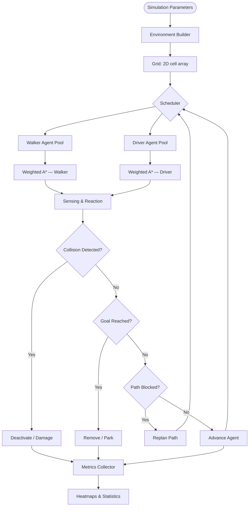
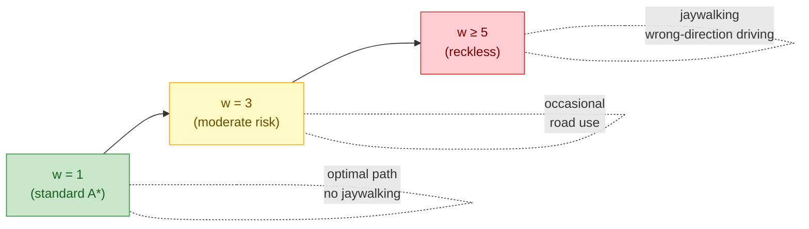
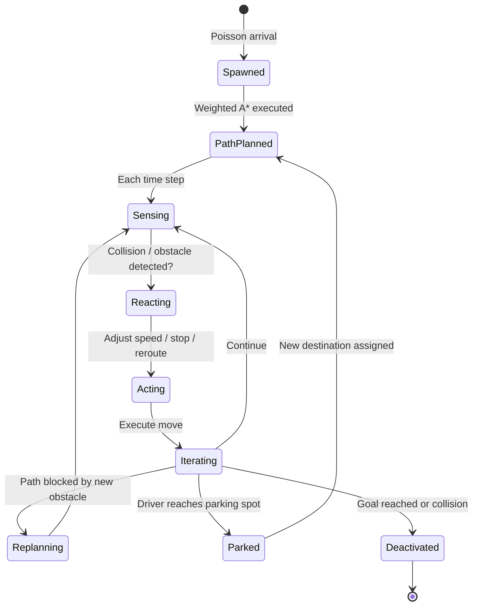
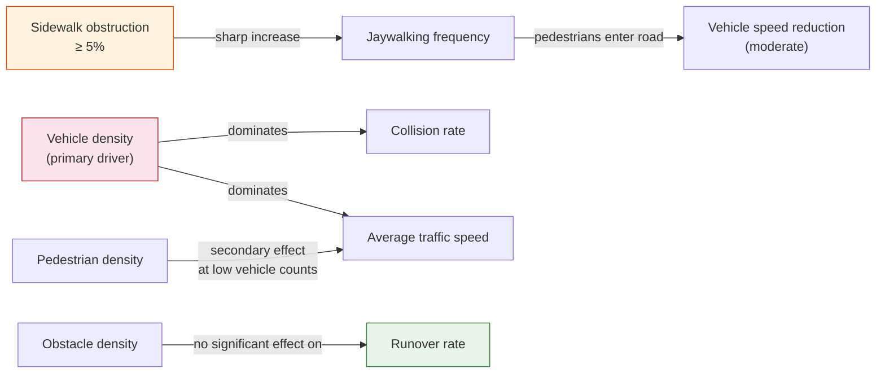

# UrbanMobility: A Multiagent Simulation of Pedestrian–Vehicle Interactions

> **Risk-weighted multiagent simulation of pedestrian–vehicle conflicts in urban environments using a behavioral extension of the Weighted A\* pathfinding algorithm.**


---

## Table of Contents

- [Overview](#overview)
- [Key Features](#key-features)
- [Project Scope](#project-scope)
- [System Architecture](#system-architecture)
- [Environment Model](#environment-model)
- [Agent Design](#agent-design)
  - [Walker Agents (Pedestrians)](#walker-agents-pedestrians)
  - [Driver Agents (Vehicles)](#driver-agents-vehicles)
- [Weighted A\* with Risk Penalty](#weighted-a-with-risk-penalty)
- [Agent Lifecycle](#agent-lifecycle)
- [Repository Structure](#repository-structure)
- [Quick Start](#quick-start)
- [Experimental Configuration](#experimental-configuration)
- [Key Results](#key-results)
- [Citing This Work](#citing-this-work)
- [License](#license)

---

## Overview

**UrbanMobility** is a Python-based multiagent simulation framework built on [AgentPy](https://agentpy.readthedocs.io/) for studying pedestrian–vehicle conflict dynamics in urban environments. The central contribution is a **risk-aware extension of the Weighted A\* pathfinding algorithm** that encodes heterogeneous behavioral profiles—ranging from strict rule-following to reckless movement—directly into each agent's cost function.

The framework is motivated by the persistent vulnerability of pedestrians in urban Latin American settings, where sidewalk obstructions, inadequate crossings, and mixed-traffic conditions contribute to high casualty rates. The simulation enables controlled experimentation over population density, obstacle placement, and behavioral parameters to identify conflict-prone zones and support urban planning decisions.

---

## Key Features

| Feature | Description |
|---|---|
| **Behavioral Weighted A\*** | Risk parameter α modulates agent recklessness within the pathfinding cost function |
| **Two agent types** | Pedestrians (walkers) and vehicles (drivers) with distinct cost tables and interaction rules |
| **Structured grid environment** | 2D cell encoding with cell type, traffic direction, and obstacle information |
| **Heterogeneous behavior** | Per-agent risk weight and max speed, sampled from distributions or set individually |
| **Poisson-distributed spawning** | Agents introduced dynamically to maintain realistic population levels |
| **Collision detection** | Euclidean distance-based detection with agent-type-specific effective radii |
| **Heatmap analysis** | Per-cell frequency maps for driver count, pedestrian count, average speed, and jaywalking |
| **Configurable experiments** | Population size, obstacle density, and behavioral weights are independently controllable |

---

## Project Scope

The simulation is designed as a **decision-support and research tool**, not a real-time traffic management system. Its primary use cases are:

- **Pedestrian safety research:** Quantifying how sidewalk obstacle density, agent behavioral profiles, and traffic volume jointly affect jaywalking frequency and runover risk.
- **Urban infrastructure assessment:** Identifying which grid zones consistently become conflict hotspots under different environmental configurations.
- **Policy testing:** Evaluating hypothetical scenarios such as street market events, construction obstructions, or changes in traffic volume limits before real-world deployment.
- **Algorithm benchmarking:** Comparing Weighted A\* behavioral variants against baseline pathfinding strategies.

The current implementation uses a **synthetic 5×5 block grid**. Integration with real OpenStreetMap data is planned as a future extension.

---

## System Architecture

The following diagram shows the high-level components of the framework and how they interact.



---

## Environment Model

The environment is a **2D grid** where each cell is encoded as a three-character string:

- **Character 1** — Cell type: `r` road, `s` sidewalk, `b` building, `p` parking, `z` zebra crossing, `o` obstacle
- **Characters 2–3** — Allowed vehicle traffic directions: `N`, `S`, `E`, `W` (combinable, e.g. `rNS` for a two-way road cell)

```
Cell encoding examples:
  rNS   →  Road, northbound or southbound traffic
  sXX   →  Sidewalk (no vehicle direction)
  zXX   →  Zebra crossing
  bXX   →  Building / impassable
  pXX   →  Parking space
```

Temporary obstacles (potholes, construction barriers, informal vendor stalls) can be added by listing their grid coordinates, enabling realistic obstructed-sidewalk scenarios such as street market simulations.

The default experimental layout is a **5×5 grid of urban blocks**, each 15×15 cells, with a 13×13 non-traversable building core per block.

---

## Agent Design

### Walker Agents (Pedestrians)

Walkers simulate pedestrians traveling between buildings. They prefer sidewalks and zebra crossings, but may step onto road cells when obstructions force a detour (jaywalking).

**Cost function (Table 1):**

| Cell Type | Symbol | Cost |
|---|---|---|
| Sidewalk | `s` | 1 |
| Zebra crossing | `z` | 1 |
| Road | `r` | 5 |
| Intersection / turn cell | `t`, `l` | 10 |
| Building / obstacle | `b`, `o` | ∞ |

- Risk function `r(a,v) = 0` for all actions (pedestrians are modeled as law-abiding; recklessness is encoded via the weight `w`).
- On zebra crossings, walkers assume right-of-way and do not stop unless physically blocked.
- Walkers stop immediately when a vehicle collision is detected off a zebra crossing.

---

### Driver Agents (Vehicles)

Drivers travel on road cells following encoded directional rules. Higher behavioral weights allow wrong-direction driving, illegal turns, and lane changes.

**Cost function (Table 2):**

| Cell Type | Symbol | Cost |
|---|---|---|
| Road | `r` | 1 |
| Zebra crossing | `z` | 1 |
| Parking space | `p` | 5 |
| Pothole | `h` | 5 |
| Sidewalk / building / obstacle | `s`, `b`, `o` | ∞ |

**Risk function (Table 3):**

| Action | Description | Risk value |
|---|---|---|
| Forward | Movement following road direction | 0 |
| Right turn | Legal right turn | 1 |
| Left turn | Legal left turn | 2 |
| Lane change | Horizontal lane change | 3 |
| Invalid turn | Illegal turn outside allowed direction | 5 |
| Backward / wrong-direction | Irresponsible or illegal movement | 20 |

---

## Weighted A\* with Risk Penalty

The core algorithmic contribution is a **risk-aware modification of Weighted A\*** used for all agent path planning:

$$f(n) = g(v) + w \cdot h(v) + \alpha \cdot r(a, v)$$

Where:

| Symbol | Meaning |
|---|---|
| `g(v)` | Accumulated cost from start to cell `v` (from cost tables above) |
| `h(v)` | Manhattan distance heuristic from `v` to goal |
| `w` | Heuristic weight — controls greediness; `w=1` is standard A\*, `w>1` is faster but yields riskier paths |
| `α` | Risk sensitivity — scales the influence of the risk penalty |
| `r(a,v)` | Risk of performing action `a` at cell `v` (from risk tables above) |

The dual role of `w` as both a computational parameter and a **behavioral parameter** is the key novelty: increasing `w` causes agents to take shorter but riskier routes, directly simulating jaywalking pedestrians or reckless drivers without requiring a separate behavioral model layer.



---

## Agent Lifecycle

Every agent follows the same four-phase loop at each discrete simulation step:



**Collision rules:**
- Two vehicles conflict if their Euclidean distance < sum of effective radii (vehicle radius: 0.8 cell units; pedestrian radius: 0.1 cell units).
- At zebra crossings, drivers yield to nearby pedestrians; a sudden pedestrian step into the road may result in a runover event.
- Pedestrians stop at potential collisions off zebra crossings; on zebra crossings they maintain right-of-way.

---

## Repository Structure

```
UrbanMobility/
│
├── UrbanMobility/              # Main package
│   ├── UrbanSimulation.ipynb   # Jupyter notebook: examples and experiments
│   ├── images/
│   │   └── UrbanModel.gif      # Animation of a running simulation
│   └── [source modules]        # Agent, environment, and scheduler classes
│
└── README.md
```

> **Entry point:** Open `UrbanMobility/UrbanSimulation.ipynb` in Jupyter to run pre-configured experiments and reproduce the paper's figures.

---

## Quick Start

### Requirements

- Python 3.9+
- [AgentPy](https://agentpy.readthedocs.io/) — `pip install agentpy`
- NumPy — `pip install numpy`
- Matplotlib — `pip install matplotlib`

### Installation

```bash
git clone https://github.com/egonzalez1989/UrbanMobility.git
cd UrbanMobility
pip install agentpy numpy matplotlib
```

### Run a basic simulation

```bash
cd UrbanMobility
jupyter notebook UrbanSimulation.ipynb
```

### Key configurable parameters

```python
parameters = {
    'n_walkers':    50,       # Number of pedestrian agents
    'n_drivers':    20,       # Number of vehicle agents
    'walker_w':     1,        # Pedestrian heuristic weight (1 = safe, 5 = reckless)
    'driver_w':     1,        # Driver heuristic weight (1 = lawful, 10 = reckless)
    'obstacles':    0.05,     # Fraction of sidewalk cells blocked (0.0–0.25)
    'steps':        1000,     # Simulation duration in discrete steps
}
```

---

## Experimental Configuration

The paper's experiments vary three parameters independently over a **5×5 block synthetic urban grid** (each block 15×15 cells):

| Parameter | Values tested |
|---|---|
| Pedestrian population | 0, 25, 50, 75, …, 200 |
| Driver population | 20, 40, 60, 80, 100 |
| Sidewalk obstruction | 0%, 5%, 10% of sidewalk cells |
| Simulation length | 1,000 steps per run |
| Agent replenishment | Yes — population held constant throughout |

**Metrics collected:**
- Average driver speed (cells/step)
- Jaywalking event count (pedestrian steps on road cells)
- Vehicle–vehicle collision rate
- Runover incident rate (pedestrian–vehicle collisions)
- Spatial heatmaps of all above metrics per cell

---

## Key Results



Key findings from the paper:

1. **Obstacle threshold effect:** As little as 5% sidewalk obstruction produces a sharp, nonlinear increase in jaywalking—even among risk-averse agents (low `w`). Maintaining unobstructed pedestrian pathways is disproportionately important for safety.
2. **Vehicle density dominates:** Both average traffic speed and vehicle collision rate are primarily governed by vehicle density, not pedestrian density or obstacle configuration.
3. **Pedestrian density has a secondary effect:** In low-vehicle-density scenarios, pedestrian movements introduce measurable delays; this effect disappears at high vehicle counts.
4. **Obstructed blocks redistribute traffic:** Agents reroute to adjacent streets, concentrating conflicts at bottleneck intersections near obstructed areas.

---

## Citing This Work

If you use this framework in your research, please cite:

```bibtex
@article{gonzalez2026urbanmobility,
  title   = {A multiagent design of urban incidents involving pedestrians
             and vehicles based on {Weighted A*}},
  author  = {Gonzalez Fernandez, Edgar},
  journal = {Preprint submitted to Elsevier},
  year    = {2026},
  note    = {INFOTEC Centro de Investigación e Innovación en TIC,
             Aguascalientes, Mexico}
}
```

---

## License

This project is released for academic and research use. Please contact the author for other usage inquiries.

**Author:** Edgar Gonzalez Fernandez — `edgar.gonzalezf@infotec.mx`  
**Affiliation:** INFOTEC Centro de Investigación e Innovación en Tecnologías de la Información y Comunicación, Aguascalientes, Mexico
